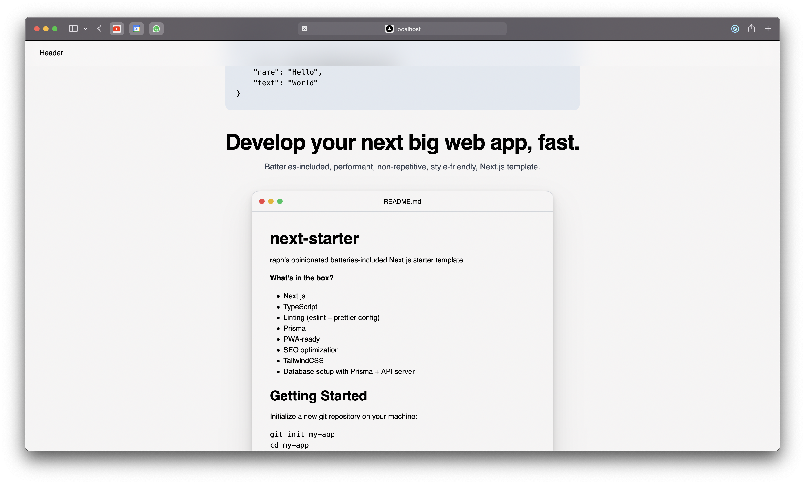

# next-starter

raph's opinionated batteries-included Next.js starter template.

**What's in the box?**
- Next.js
- TypeScript
- Linting (eslint + prettier config)
- Prisma
- PWA-ready (Disabled by default)
- SEO optimization
- TailwindCSS
- Database setup with Prisma + API server



## Getting Started

Either click on the "Use this template" button on GitHub, or

Download this template and initialize a new repository:

```shell
git clone https://github.com/raphtlw/next-starter.git --depth=1 my-app
cd my-app
rm -rf .git
git init
```

Install dependencies:

```shell
npm i
```

Copy `.env.example` to `.env.local` and `prisma/.env.example` to `prisma/.env`, open them and change the default values to the appropriate values for your project.

```shell
cp .env.example .env.local
cp prisma/.env.example prisma/.env
```

Run development server:

```shell
npm run dev
```

Open [http://localhost:3000](http://localhost:3000) with your browser to see the result.

You can start editing the page by modifying `pages/index.tsx`. The page auto-updates as you edit the file.

[API routes](https://nextjs.org/docs/api-routes/introduction) can be accessed on [http://localhost:3000/api/hello](http://localhost:3000/api/hello). This endpoint can be edited in `pages/api/hello.ts`.

The `pages/api` directory is mapped to `/api/*`. Files in this directory are treated as [API routes](https://nextjs.org/docs/api-routes/introduction) instead of React pages.

## Folder Structure

- `pages` &mdash; Next.js pages
- `components` &mdash; Components that are re-used across the project.
- `layouts` &mdash; Layout components that are used across the project, see `pages/index.tsx` for an example on how they are used.
- `styles` &mdash; Global styles that are used across the project, no CSS modules are to be stored there.
- `public` &mdash; Everything that is placed in the / of the website after building.
- `lib` &mdash; Utilities, types, interfaces, temporary mock data, etc.

## How to pull the latest changes

Pull the latest version of this repository into your project like so:

```shell
git pull https://github.com/raphtlw/next-starter.git
```

## PWA support

PWA support is provided via [next-pwa](https://www.npmjs.com/package/next-pwa). You can enable it by flipping the `PWA_ENABLED` variable in the `.env.local` file to `true`.
